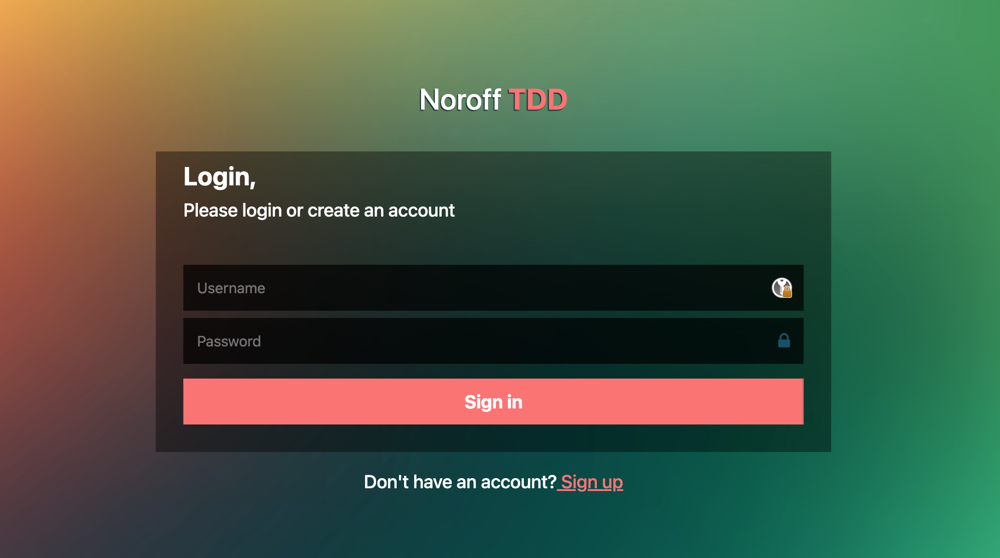
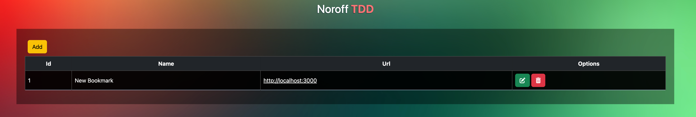

# Noroff
## Back-end Development Year 1
### SRV - Module 3 - TDD lesson

Startup code for Noroff back-end development 1 - SRV TDD Lesson.

Remember to create a cloud MySQL service you can use [Aiven.io](https://aiven.io)

**Important** - delete your service once you are completed.

#### .env file
Create a .env file with your login credentials from Aiven.io
```js
HOST =
ADMIN_USERNAME =
ADMIN_PASSWORD =
DATABASE_NAME =
DATABASE_PORT = 3306
DIALECT = "mysql"
DIALECTMODEL = "mysql2"
PORT = "3000"
TOKEN_SECRET= <generate a secret>
```

The front-end login page


The bookmark page

